[TOC]

# Dockerize Project

## 실습

### 도커 개발환경 설정

- 설치

- 설치 후 도커 버전 확인

  ```powershell
  docker -v
  ```

  

- 테스트용 Hello world 도커 컨테이너 실행

  ```powershell
  docker run hello-world
  
  docker run --name=[컨테이너 이름]		# 자동 이름 대신 지정된 이름으로 생성
  ```

  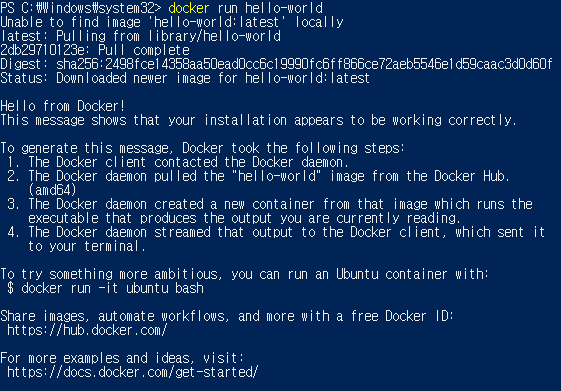


### 도커 기본 명령어 실습

- 컨테이너 조회

  ```powershell
  docker ps -a
  ```

  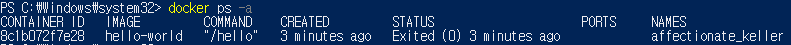

- Hello world 컨테이너 삭제

  ```powershell
  docker rm [컨테이너 ID / NAME]		# ID는 앞부분만 입력 가능 ex) docker rm 8c
  ```

  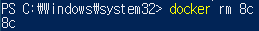

- 도커 이미지 조회

  ```powershell
  docker images
  ```

  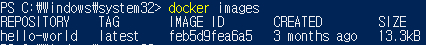

- Hello world 도커 이미지 삭제

  ```powershell
  docker rmi [이미지 ID / 이미지명:TAG 명]
  ```

  

### 샘플 서비스(Jenkins)를 이용한 도커 실습

https://hub.docker.com/r/jenkins/jenkins

- Jenkins를 도커 컨테이너로 실행 및 실행(Up STATUS)중인지 확인

  ```powershell
  docker run --name myjenkins -d -p 9080:8080 jenkins/jenkins
  
  docker ps
  ```

  - -d : 백그라운드 데몬으로 실행 시키는 옵션
  - -p : 가상 머신(Guest PC)에서 동작하는 서비스에 docker proxy 서비스가 NAT 기능을 수행해 포트포워딩을 해주어 실제 머신(HOST PC) IP로 서비스에 접속이 가능하도록 해줌

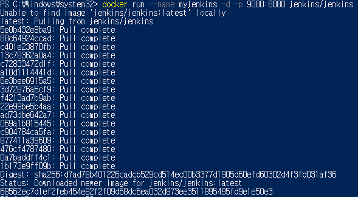

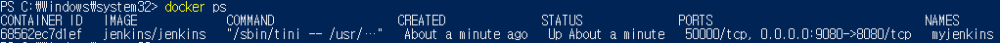

- Jenkins 서버 컨테이너의 bash 실행 후 컨테이너의 OS 버전 확인

  ```powershell
  docker exec -it myjenkins bash
  
  cat /etc/issue
  ```

  - -it = -i + -t
    - -i (interactive) : 표준입출력을 키보드와 화면을 통해 가능하도록 하는 옵션
    - -t : 텍스트 기반의 터미널(TTY)을 에뮬레이션 해주는 옵션 


- 컨테이너 안(bash)에서 Admin 패스워드가 저장된 파일 확인 후 컨터이너 bash 종료

  ```powershell
  cat /var/jenkins_home/secrets/initialAdminPassword
  ```

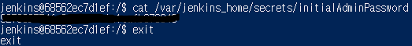

- 위 두개를 한번에 실행하기

  ```powershell
  docker exec myjenkins cat /var/jenkins_home/secrets/initialAdminPassword
  ```

  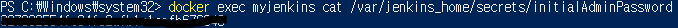

- 컨테이너 안에 있는 패스워드 파일을 개발 PC로 복사하기

  ```powershell
  docker cp myjenkins:/var/jenkins_home/secrets/initialAdminPassword ./
  
  dir
  initialAdminPassword
  ```

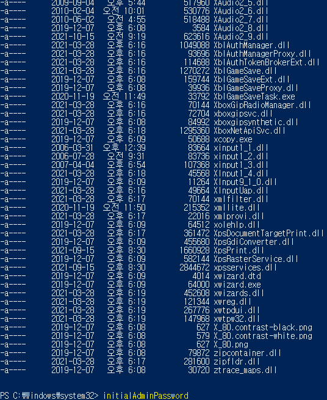

- 웹 브라우져에서 접속(http://localhost:9080)해서 앞서 확인 한 패스워드를 붙여 넣고 Jenkins 설정을 계속 진행하기
- Install suggested plugins 선택 → 계정 설정까지 완료해서 환영 페이지 확인


- 컨테이너를 재시작해서 Up Status 시간이 초기화 된 것을 확인 후 삭제

  ```powershell
  docker restart myjenkins
  docker ps
  
  docker rm -f myjenkins
  ```

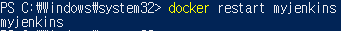


### 관통 프로젝트 프론트엔드 도커 이미지 제작

- 관통 프로젝트 코드 다운로드

- 로컬에서 프론트엔드 실행 및 웹 브라우저로 접속(http://localhost:8080)해서 확인

  ```bash
  npm install
  npm run serve
  ```


- <project_home>/frontend/Dockerfile을 작성 후 프론트엔드용 도커 이미지 빌드

  https://kr.vuejs.org/v2/cookbook/dockerize-vuejs-app.html

  ```bash
  docker build . -t front:0.1
  
  docker images
  ```
  

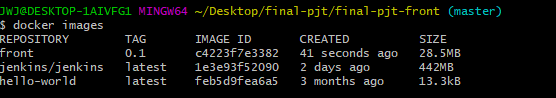

- 이미지에 TAG 추가하기

  ```bash
  docker tag front:0.1 front:latest
  ```

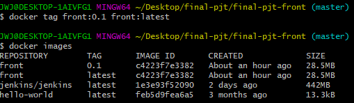

- 이미지에 TAG 삭제하기

  ```bash
  docker rmi front
  ```


- 도커로 프론트엔드 실행 및 웹 브라우저로 접속(http://localhost)해서 확인

  ```bash
  docker run -it -p 80:80 --rm front:0.1
  ```


> winpty 문제가 생기면 위의 코드 앞에 winpty 작성해주면 됨


### 관통 프로젝트 백엔드 도커 이미지 제작

- 로컬에서 백엔드 실행 및 확인 (http://localhost:8000)


## 정리

### Docker

OS 레벨 가상화를 이용하여 컨테이너화 된 소프트웨어 패키징 및 관리가 가능한 가상화 도구

- 링크
  - 다운로드 : https://www.docker.com/products/docker-desktop
  - 허브 : https://hub.docker.com/search
  - 튜토리얼 : https://www.44bits.io/ko/post/easy-deploy-with-docker
  - 컴포즈 활용 : https://www.44bits.io/ko/post/almost-perfect-development-environment-with-docker-and-docker-compose
  - 동영상 강의 : https://www.youtube.com/playlist?list=PLApuRlvrZKogb78kKq1wRvrjg1VMwYrvi

> 직접 배포 시 생소한 리눅스에 다양한 언어별 환경 구성, 의존성 패키지/라이브러리, 빌드 툴 등을 설치하면서 어려움을 겪음
>
> 매번 새로운 버전이 출시 되어 버전이슈 발생
>
> 생각지도 못한 환경적인 문제로 코드가 새로운 배포 환경에서 예상처럼 동작한다는 보장 없음
>
> 이러한 과정을 매번 여러 대의 서버에 세팅하는 것은 작업자 실수 야기 가능성↑
>
> 배포 경험 작업자에게 국한되어 공유 힘듬

- Docker를 알아야 하는 이유
  - DevOps 문화가 확산 → 인프라를 잘 모르는 개발자도 쉽게 서버 제작 가능
  - 개발하면서 자주 접할 가능성 높음

- 장점
  - 설치 과정은 Dockerfile로 문서화, 수정 이력은 버전 관리됨 → 변경사항 확인 쉬움
  - 문제 발생시 롤백 편리
  - VM 이미지 대비 용량 및 실행속도 빠름
  - 개발과정에서 필요한 환경 구성이 편리
  - 여러 가지 서비스를 레고 블럭처럼 쌓아 매쉬업 하기 용이
