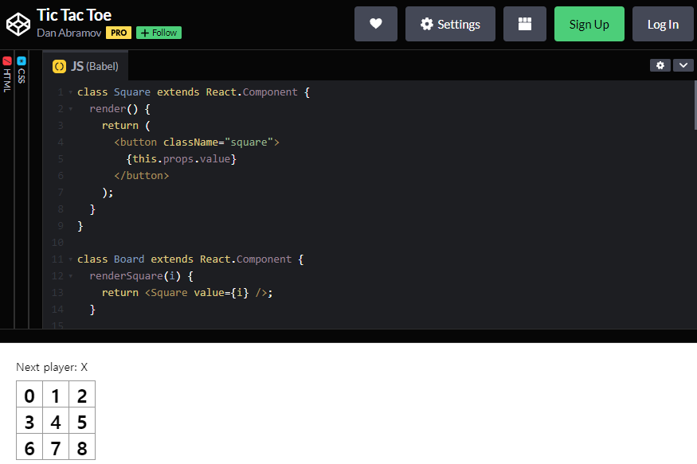
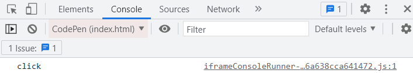
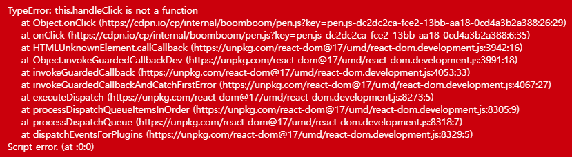
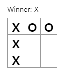

[TOC]

# React로 만드는 Tic Tac Toe

## 실습

공식 홈페이지 : https://ko.reactjs.org/

Tic Tac Toe 최종 결과물 : https://codepen.io/gaearon/pen/gWWZgR?editors=0010

### 초기 코드

```js
class Square extends React.Component {
  render() {
    return (
      <button className="square">
        {/* TODO */}
      </button>
    );
  }
}

class Board extends React.Component {
  renderSquare(i) {
    return <Square />;
  }

  render() {
    const status = 'Next player: X';

    return (
      <div>
        <div className="status">{status}</div>
        <div className="board-row">
          {this.renderSquare(0)}
          {this.renderSquare(1)}
          {this.renderSquare(2)}
        </div>
        <div className="board-row">
          {this.renderSquare(3)}
          {this.renderSquare(4)}
          {this.renderSquare(5)}
        </div>
        <div className="board-row">
          {this.renderSquare(6)}
          {this.renderSquare(7)}
          {this.renderSquare(8)}
        </div>
      </div>
    );
  }
}

class Game extends React.Component {
  render() {
    return (
      <div className="game">
        <div className="game-board">
          <Board />
        </div>
        <div className="game-info">
          <div>{/* status */}</div>
          <ol>{/* TODO */}</ol>
        </div>
      </div>
    );
  }
}

// ========================================

ReactDOM.render(
  <Game />,
  document.getElementById('root')
);
```

- React 컴포넌트
  - Square : `<button>` 렌더링
  - Board : 사각형 9개 렌더링
  - Game : 게임판 렌더링, 나중에 수정할 자리 표시자 값 가지고 있음

### Props를 통해 데이터 전달하기

- Borad에서 value 보내기

```js
class Board extends React.Component {
  renderSquare(i) {
    return <Square value={i} />;
  }
```

- Square에서 value 받기

```js
class Square extends React.Component {
  render() {
    return (
      <button className="square">
        {this.props.value}
      </button>
    );
  }
}
```

- 결과



Props를 통해 부모 Board 컴포넌트에서 자식 Square 컴포넌트로 데이터 전달 완료

### 사용자와 상호작용하는 컴포넌트 만들기

- Square 컴포넌트 클릭 시 X 체크되도록 만들기

```js
class Square extends React.Component {
  render() {
    return (
      <button className="square" onClick={function() {
          console.log('click');
        }}>
        {this.props.value}
      </button>
    );
  }
}

// 화살표 함수 사용
class Square extends React.Component {
  render() {
    return (
      <button className="square" onClick={() =>
          console.log('click');
        }>
        {this.props.value}
      </button>
    );
  }
}
```



- 클릭을 기억하게 만들어 X 표시를 채워 넣기

  - 클래스에 생성자 추가하여 state 초기화

  ```js
  class Square extends React.Component {
    constructor(props) {	// 생성자
      super(props);		// 모든 React 컴포넌트 클래스는 생성자를 가질 때 super(props) 호출 구문부터 작성
      this.state = {
        value: null,
      };
    }
    
    render() {
      return (
        <button className="square" onClick={() =>
            console.log('click');
          }>
          {this.props.value}
        </button>
      );
    }
  }
  ```

  - Square 클릭 시 현재 state 값을 표시하기 위해 render 함수 변경

  ```js
  class Square extends React.Component {
    constructor(props) {
      super(props);
      this.state = {
        value: null,
      };
    }
    
    render() {
      return (
        <button 
          className="square" 
          onClick={() => this.setState({value: 'X'})}
        >
          {this.state.value}
        </button>
      );
    }
  }
  ```


### state 끌어올리기

- state를 부모 컴포넌트로 끌어올리기

```js
class Board extends React.Component {
  constructor(props) {
    super(props);
    this.state = {
      squares: Array(9).fill(null),
    };
  }
```

- Square의 자체 state가 아닌 Board에서 squares를 보내기

```js
  renderSquare(i) {
      return <Square value={this.state.squares[i]} />;
  }
```

- Square에서 Board의 state를 직접 변경

```js
// Board
  renderSquare(i) {
    return (
      <Square 
        value={this.state.squares[i]} 
        onClick={() => this.handleClick(i)}
      />
    );
  }
  
// Square
class Square extends React.Component {
  render() {
    return (
      <button 
        className="square" 
        onClick={() => this.props.onClick()}
      >
        {this.props.value}
      </button>
    );
  }
}
```

> 1. 내장된 DOM `<button>` 컴포넌트에 있는 `onClick` prop은 React에게 클릭 이벤트 리스너를 설정하라고 알려줍니다.
>
> 2. 버튼을 클릭하면 React는 Square의 `render()` 함수에 정의된 `onClick` 이벤트 핸들러를 호출합니다.
>
> 3. 이벤트 핸들러는 `this.props.onClick()`를 호출합니다. Square의 `onClick` prop은 Board에서 정의되었습니다.
>
> 4. Board에서 Square로 `onClick={() => this.handleClick(i)}`를 전달했기 때문에 Square를 클릭하면 Board의 `handleClick(i)`를 호출합니다.
>
> 5. 아직 `handleClick()`를 정의하지 않았기 때문에 코드가 깨질 것입니다. 지금은 사각형을 클릭하면 “this.handleClick is not a function”과 같은 내용을 표시하는 붉은 에러 화면을 보게됩니다.
>
>    

- handleClick 추가

```js
// Board
  handleClick(i) {
    const squares = this.state.squares.slice();	// slice로 기존 배열의 복사본 생성
    squares[i] = 'X';
    this.setState({squares: squares});
  }
```

### 함수 컨포넌트

- Square 클래스 → 함수 변경

```js
function Square(props) {
  return (
    <button className="square" onClick={props.onClick}>
      {props.value}
    </button>
  );
}
```

### 순서 만들기

```js
class Board extends React.Component {
  constructor(props) {
    super(props);
    this.state = {
      squares: Array(9).fill(null),
      xIsNext: true,	// 플레이어 초기화
    };
  }
  
  handleClick(i) {
    const squares = this.state.squares.slice();
    squares[i] = this.state.xIsNext ? 'X' : 'O';	// true/false에 따라 다음 플레이어 결정
    this.setState({
      squares: squares,
      xIsNext: !this.state.xIsNext,	// state에 플레이어 저장
    });
  }
  
  renderSquare(i) {
    return (
      <Square 
        value={this.state.squares[i]} 
        onClick={() => this.handleClick(i)}
      />
    );
  }

  render() {
    const status = 'Next player: ' + (this.state.xIsNext ? 'X' : 'O');	// 텍스트도 맞춰줌

    return (
      <div>
        <div className="status">{status}</div>
        <div className="board-row">
          {this.renderSquare(0)}
          {this.renderSquare(1)}
          {this.renderSquare(2)}
        </div>
        <div className="board-row">
          {this.renderSquare(3)}
          {this.renderSquare(4)}
          {this.renderSquare(5)}
        </div>
        <div className="board-row">
          {this.renderSquare(6)}
          {this.renderSquare(7)}
          {this.renderSquare(8)}
        </div>
      </div>
    );
  }
}
```


### 승자 결정하기

- 도우미 함수 추가

```js
...	// 최하단에 작성

function calculateWinner(squares) {
  const lines = [
    [0, 1, 2],
    [3, 4, 5],
    [6, 7, 8],
    [0, 3, 6],
    [1, 4, 7],
    [2, 5, 8],
    [0, 4, 8],
    [2, 4, 6],
  ];
  for (let i = 0; i < lines.length; i++) {
    const [a, b, c] = lines[i];
    if (squares[a] && squares[a] === squares[b] && squares[a] === squares[c]) {
      return squares[a];
    }
  }
  return null;
}
```

- calculateWinner(squares) 호출

```js
// Board
...
  render() {
    const winner = calculateWinner(this.state.squares);
    let status;
    if (winner) {
      status = 'Winner: ' + winner;
    } else {
      status = 'Next player: ' + (this.state.xIsNext ? 'X' : 'O');
    }
...
```

- 게임 끝났다면 클릭 안되도록 변경

```js
// Board
...
  handleClick(i) {
    const squares = this.state.squares.slice();
    if (calculateWinner(squares) || squares[i]) {	// 누군가가 승리하거나 다 채워졌다면
      return;
    }
    squares[i] = this.state.xIsNext ? 'X' : 'O';
    this.setState({
      squares: squares,
      xIsNext: !this.state.xIsNext,
    });
  }
...
```



### 시간 여행 추가하기

```js
class Board extends React.Component {
  renderSquare(i) {
    return (
      <Square 
        value={this.props.squares[i]} 
        onClick={() => this.props.onClick(i)}
      />
    );
  }

  render() {
    return (
      <div>
        <div className="board-row">
          {this.renderSquare(0)}
          {this.renderSquare(1)}
          {this.renderSquare(2)}
        </div>
        <div className="board-row">
          {this.renderSquare(3)}
          {this.renderSquare(4)}
          {this.renderSquare(5)}
        </div>
        <div className="board-row">
          {this.renderSquare(6)}
          {this.renderSquare(7)}
          {this.renderSquare(8)}
        </div>
      </div>
    );
  }
}

class Game extends React.Component {
  constructor(props) {
    super(props);
    this.state = {
      history: [{
        squares: Array(9).fill(null),
      }],
      xIsNext: true,
    };
  }
  
  handleClick(i) {
    const history = this.state.history;
    const current = history[history.length - 1];
    const squares = current.squares.slice();
    if (calculateWinner(squares) || squares[i]) {
      return;
    }
    squares[i] = this.state.xIsNext ? 'X' : 'O';
    this.setState({
      history: history.concat([{
        squares: squares,
      }]),
      xIsNext: !this.state.xIsNext,
    });
  }
  
  render() {
    const history = this.state.history;
    const current = history[history.length - 1];
    const winner = calculateWinner(current.squares);
    let status;
    if (winner) {
      status = 'Winner: ' + winner;
    } else {
      status = 'Next player: ' + (this.state.xIsNext ? 'X' : 'O');
    }
    
    return (
      <div className="game">
        <div className="game-board">
          <Board
            squares={current.squares}
            onClick={(i) => this.handleClick(i)}
          />
        </div>
        <div className="game-info">
          <div>{/* status */}</div>
          <ol>{/* TODO */}</ol>
        </div>
      </div>
    );
  }
}
```

### 과거의 이동 표시하기

```js
// Game
...

  render() {
    const history = this.state.history;
    const current = history[history.length - 1];
    const winner = calculateWinner(current.squares);
    
    const moves = history.map((step, move) => {
      const desc = move ?
        'Go to move #' + move :
        'Go to game start';
      return (
        <li>
          <button onClick={() => this.jumpTo(move)}>{desc}</button>
        </li>
      );
    });
    
    let status;
    if (winner) {
      status = 'Winner: ' + winner;
    } else {
      status = 'Next player: ' + (this.state.xIsNext ? 'X' : 'O');
    }
    
    return (
      <div className="game">
        <div className="game-board">
          <Board
            squares={current.squares}
            onClick={(i) => this.handleClick(i)}
          />
        </div>
        <div className="game-info">
          <div>{status}</div>
          <ol>{moves}</ol>
        </div>
      </div>
    );
  }
```

### Key 선택하기

```js
// Game
...
    const moves = history.map((step, move) => {
      const desc = move ?
        'Go to move #' + move :
        'Go to game start';
      return (
        <li key={move}>
          <button onClick={() => this.jumpTo(move)}>{desc}</button>
        </li>
      );
    });
...
```

### 시간 여행 구현하기

```js
class Game extends React.Component {
  constructor(props) {
    super(props);
    this.state = {
      history: [{
        squares: Array(9).fill(null),
      }],
      stepNumber: 0,	// 현재 진행 중인 단계 표시
      xIsNext: true,
    };
  }
  
  handleClick(i) {
    const history = this.state.history.slice(0, this.state.stepNumber + 1);	// 새로운 이동 발생하면 예전의 미래 기록 날림
    const current = history[history.length - 1];
    const squares = current.squares.slice();
    if (calculateWinner(squares) || squares[i]) {
      return;
    }
    squares[i] = this.state.xIsNext ? 'X' : 'O';
    this.setState({
      history: history.concat([{
        squares: squares,
      }]),
      stepNumber: history.length,	// stepNumber 업데이트
      xIsNext: !this.state.xIsNext,
    });
  }
  
  jumpTo(step) {	// stepNumber 업데이트
    this.setState({
      stepNumber: step,
      xIsNext: (step % 2) === 0,	// 짝수일 때 마다 true
    })
  }
  
  render() {
    const history = this.state.history;
    const current = history[this.state.stepNumber];	// 항상 마지막 이동이 아닌 현재 선택된 이동을 렌더링
    const winner = calculateWinner(current.squares);
    
    const moves = history.map((step, move) => {
      const desc = move ?
        'Go to move #' + move :
        'Go to game start';
      return (
        <li key={move}>
          <button onClick={() => this.jumpTo(move)}>{desc}</button>
        </li>
      );
    });
    
    let status;
    if (winner) {
      status = 'Winner: ' + winner;
    } else {
      status = 'Next player: ' + (this.state.xIsNext ? 'X' : 'O');
    }
    
    return (
      <div className="game">
        <div className="game-board">
          <Board
            squares={current.squares}
            onClick={(i) => this.handleClick(i)}
          />
        </div>
        <div className="game-info">
          <div>{status}</div>
          <ol>{moves}</ol>
        </div>
      </div>
    );
  }
}
```


## 정리

### React

사용자 인터페이스를 구축하기 위한 선언적, 효율적, 유연한 JavaScript 라이브러리

컴포넌트 라고 불리는 작고 고립된 코드의 파편을 이용하여 복잡한 UI를 구성하도록 도움

- 데이터 변경
  - 객체 변경을 통해 데이터 수정
  - 객체 변경 없이 데이터 수정
    - 장점
      - 복잡한 특징들을 단순하게 만듬 (이력 확인, 이전 동작으로 되돌아가기)
      - 변화 감지
      - React에서 다시 렌더링하는 시기 결정
